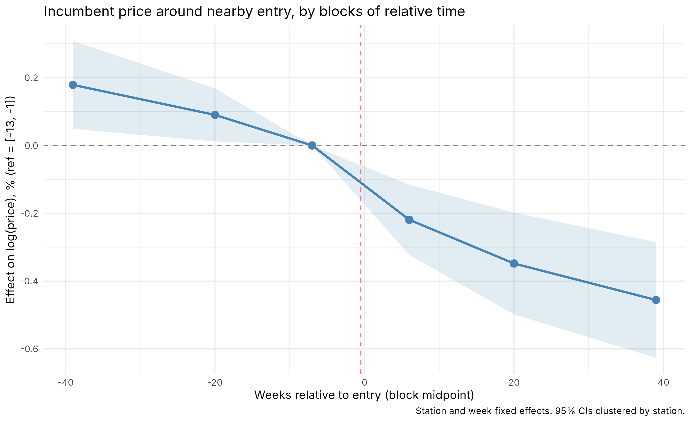
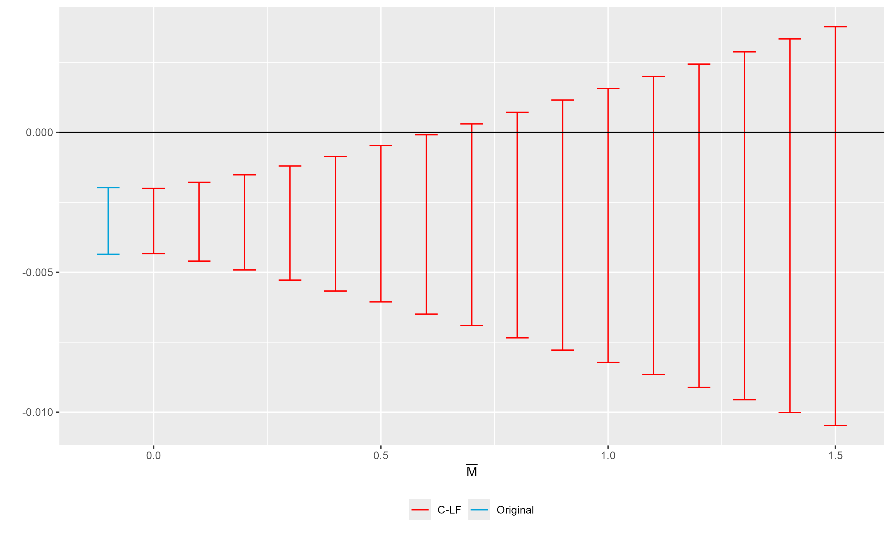

# Spatial Competition and Retail Gasoline Prices in Chile

Does the entry or exit of a nearby gas station change the prices of incumbent stations? I apply the event-study design of Taylor and Muehlegger (2025) to a station-week panel of retail gasoline prices from Chile's National Energy Commission (CNE): about 973,000 station-weeks from 2,022 stations over 743 weeks (January 2012 to March 2026), built from 9.2 million raw price reports.

Methods: two-way fixed effects · event study · spatial competition measures (Haversine, validated against driving distances) · window and block-dynamics diagnostics · Rambachan–Roth (HonestDiD) sensitivity to parallel-trends violations · Conley standard errors

## Main findings

- Exit has a precisely estimated null effect. The exit of a competitor within 1 km leaves incumbent prices unchanged: the 95% confidence interval rules out effects larger than about 0.1% of the retail price. The null holds in every event window (±13 to ±52 weeks), with clustering by station or municipality and Conley errors, for rival-brand exits, and after removing exits that may reflect selection.
- The apparent entry effect is not robust. A ±52-week DiD gives an entry effect of −0.18%. However, incumbent prices are already falling before entry: both pre-entry blocks are positive and significant relative to the quarter before entry, and the trajectory declines steadily through the event without a break. The estimate shrinks as the window narrows and is indistinguishable from zero at ±13 weeks. I assess its robustness to parallel-trends violations with Rambachan–Roth (HonestDiD) sensitivity analysis.
- Common shocks dominate price variation. Week fixed effects account for 98.4% of the variation in log retail prices, highlighting the importance of common national shocks. This pattern is consistent with the dominant role of common wholesale-cost movements and with pricing mechanisms documented in the Chilean gasoline-market literature (Lemus and Luco 2021; Luco 2019). The decomposition does not by itself identify which common component matters, or tacit coordination.



*Incumbent log price around the entry of a station within 1 km, by blocks of relative time (reference: the quarter before entry). The decline starts before entry and continues through it without a break.*



*Rambachan–Roth robust confidence sets for the average post-entry effect (rival-brand entry), as a function of how large post-entry violations of parallel trends may be relative to pre-entry ones (M̄).*

## Reproducing the results

```r
source("run_all.R")
```

This checks dependencies, cleans the data, builds entry and exit events, estimates every model, writes tables and figures to `output/` (README figures to `figures/`) and compiles the paper. Console logs for each step go to `output/logs/`.

Requirements: R ≥ 4.2 and the packages listed in `R/00_setup.R`. If a `renv.lock` file is present, `run_all.R` restores the pinned R environment automatically; after the first successful full-data run, create and commit it with `renv::init()` / `renv::snapshot()`. A validated `data/panel_estacion_semana.csv` is sufficient to reproduce the econometric analysis. To rebuild that panel from the raw CNE archive, Python 3 plus `pip install -r requirements.txt` are also required. See [`data/README.md`](data/README.md).

| Step | Script | Content |
|---|---|---|
| 1 | `R/00_setup.R` | Packages, paths, sample constants, helper functions |
| 2 | `R/01_build_panel.R` | Station-week panel from raw CNE price records |
| 3 | `R/02_clean_data.R` | Price filter, brand changes, entry/exit/incumbent definitions |
| 4 | `R/03_main_analysis.R` | TWFE by radius, pre/post MEPCO, baseline entry/exit DiD, heterogeneity, inference robustness |
| 5 | `R/04_event_study.R` | Window sensitivity, block and weekly event studies, rival-brand entry, HonestDiD |
| 6 | `R/05_robustness.R` | Selection in exits, entrant brand, operator proxy, co-movement |
| 7 | `R/06_mechanisms.R` | Variance decomposition, effects relative to margins, pass-through |

## Repository structure

```
.
├── README.md
├── run_all.R
├── renv.lock        pinned R environment (generate after the full-data run)
├── R/              analysis scripts (run in order by run_all.R)
├── scripts/        Python builder for the raw CNE archive
├── requirements.txt Python dependencies needed only to rebuild the panel
├── data/           input data (not versioned; see data/README.md)
├── figures/        main figures shown in this README (versioned)
├── output/         all generated tables, figures and logs (not versioned)
└── paper/          paper (R Markdown + PDF) and bibliography
```

## Data

All inputs are public, from the CNE's *Bencina en Línea* / *Energía Abierta* portal (https://www.energiaabierta.cl): one compressed CSV per year, 2012 to 2026 (about 100 MB). They are not versioned because of their size. `scripts/build_panel.py` turns them into the station-week panel; [`data/README.md`](data/README.md) documents the archive's format changes and how the panel handles them (2012 onboarding, the 2022/2023 change of system, brand histories). The driving-distance sample used to validate Haversine distances comes from the Google Maps API and is optional; the analysis runs without it.

## References

Taylor and Muehlegger (2025, NBER WP 33569) · Lemus and Luco (2021, JIE) · Rambachan and Roth (2023, ReStud) · Hastings (2004, AER) · Houde (2012, AER) · Barron, Taylor and Umbeck (2004, IJIO) · Lewis (2012, IJIO) · Luco (2019, AEJ: Micro)

## Author

Eduardo Munizaga, Facultad de Economía y Negocios, Universidad de Chile. Originally written as a research paper for Microeconomics III.
